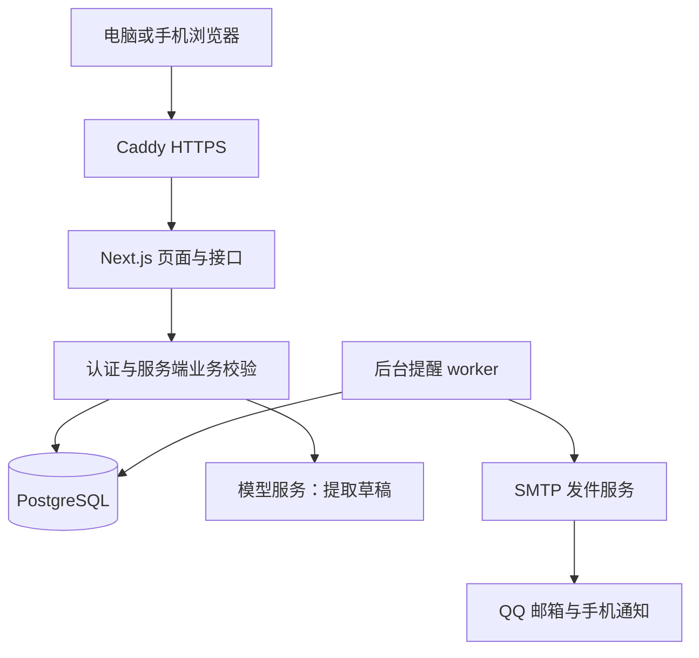

# 技术架构与选型

版本：1.1 · 日期：2026-09-14。以下为已选择的架构方案，尚未部署或实测。具体依赖补丁版本在初始化时核对兼容性并锁定，禁止浮动安装 latest 进入生产。

## 1. 选择结论

采用 TypeScript 单仓库、Next.js 全栈网页、PostgreSQL 数据库和独立 Node.js 提醒进程。部署采用单台持续在线的 Linux 云服务器和 Docker Compose；Caddy 负责 HTTPS 入口，数据库不暴露公网。手机和电脑访问同一网站。

| 层 | 选择 | 理由 |
| --- | --- | --- |
| 网页与接口 | Next.js App Router、React、TypeScript | 一套代码同时覆盖响应式页面和业务接口 |
| 样式 | Tailwind CSS | 统一间距和响应式规则；首版不叠加多套组件库 |
| 日历 | FullCalendar Standard 的 React 集成 | 使用月、周、列表等标准能力，不采购 Premium |
| 数据 | PostgreSQL＋Prisma | 事务保存关联数据，类型化模型与迁移 |
| 输入验证 | Zod | 模型输出、表单和接口都经过服务端校验 |
| 身份认证 | Better Auth，邮箱密码登录 | 使用现成会话能力；初始化个人账号后禁用公开注册 |
| 邮件 | Nodemailer＋经验证的 SMTP 发件服务 | 收件人为用户 QQ 邮箱；发件服务与收件邮箱分离 |
| 后台任务 | 独立 Node.js worker＋数据库队列表 | 小规模够用，不引入 Redis、消息中间件或微服务 |
| 助理 | 服务端调用支持 JSON 输出的模型 HTTP API | 只负责提取和表达；校验、排程、执行由业务代码决定 |
| 测试 | Vitest＋Playwright＋真实 PostgreSQL 集成测试 | 覆盖时间规则、并发和跨设备关键流程 |
| 部署 | Docker Compose＋Caddy＋持久化磁盘 | 网页和 worker 独立重启，数据持续保存 |

Next.js 官方支持 Node.js/Docker 自托管；FullCalendar 标准功能采用 MIT 许可。选型依据见[官方参考资料](../05_参考资料/技术来源.md)。

## 2. 备选方案比较

| 方案 | 优点 | 代价 | 决定 |
| --- | --- | --- | --- |
| 单服务器＋数据库＋worker | 后台调度独立、部署结构清楚、供应商依赖少 | 要维护备份和服务健康 | 首版采用 |
| 托管前端＋托管数据库＋外部定时服务 | 减少部分服务器维护 | 多服务配置，定时额度与地区连通性需核实 | 当前不采用 |
| 纯本地网页 | 演示方便 | 不能满足设备关闭后提醒和跨设备共享 | 不满足需求 |

服务器具体供应商和地区在上线前通过手机与电脑网络实测选择，不把未验证的地域、费用或邮件可达性写成事实。模型供应商也在匿名样例评测后确定；接口边界现已固定，不影响前四个阶段开发。

## 3. 组件与数据流

业务模块保持在同一仓库：applications 管岗位和阶段；events 管日程和完成；assistant 管来源及草稿；resumes 管简历版本；preparations 管面试准备、修订和资料复用；research 管联网来源和模拟问答；scheduling 是确定性候选算法；notifications 管队列和 SMTP。模块共享数据库事务，不拆独立网络服务。

计划源码目录为 app/、src/server/{applications,events,assistant,scheduling,notifications,resumes,preparations,research}/、src/worker/、prisma/、tests/ 和 deploy/，与现有项目文档并存。

## 4. 核心数据模型

所有业务表包含 id、user_id、created_at、updated_at；可编辑核心对象增加 version 乐观锁。时间戳使用 timestamptz，以 UTC 存储，显示转换到 Asia/Shanghai。仅日期来源另外存 date，不伪装成精确时间。

| 实体 | 关键字段与约束 |
| --- | --- |
| User/Session | 使用认证库表；用户设置保存已验证收件地址、时区和偏好 |
| Application | 公司、岗位、批次、城市、申请编号、投递时间、stage、stage_status、terminal_outcome、version |
| ApplicationHistory | application_id、前后状态、发生时间、来源；与更新事务保存 |
| Event | application_id 可空、类型、起止、deadline_at、deadline_date、status、version；开始或截止至少一个 |
| Availability | 用户确认的周内可用时段；特殊不可用时间用 Event 表示 |
| Source | 类型、URL、原文、原文时间、内容哈希；正文可删除 |
| AssistantDraft | source_id、结构化候选、字段依据、目标对象版本、状态、confirmation_key 唯一 |
| Reminder | event_id、类型、相对偏移或绝对时刻、渠道、启用状态 |
| NotificationJob | reminder_id、event_version、scheduled_at、state、attempts、lease_until、last_error、accepted_at |

提醒唯一键为 reminder_id＋event_version＋scheduled_at＋channel；同任务同时间多个原因在调度阶段合并。索引至少覆盖用户与日期、用户与岗位阶段、state 与下次尝试时间。重复岗位只提示，不将公司名＋岗位设为硬唯一。

## 5. API 与一致性边界

- /api/applications：列表、创建、更新、详情；阶段修改同时追加历史。列表接口接受公司、城市、岗位、批次、阶段、阶段状态、终止结果的多值筛选、关键词、排序与分页。服务端在当前账号范围内按同字段 OR、跨字段 AND 构造参数化查询，结果与总数共用过滤条件；空值使用显式筛选标记，不与真实文本混淆。筛选选项仅返回当前账号已有值，不受当前分页限制。
- /api/events：查询日期范围、创建、改期、完成、取消、删除。
- /api/assistant/drafts：解析输入并保存草稿；/confirm 携带草稿 ID、对象 version 和幂等键。
- /api/settings：可用时段、提醒偏好、邮箱验证和测试发送。
- /api/exports：下载 CSV 或业务 JSON；仅当前账号。

所有变更经身份校验、对象归属检查和 Zod 校验。会话使用安全 HttpOnly Cookie，启用来源校验和库的 CSRF 防护，认证、模型调用、测试邮件有频率限制。多设备首版通过重新进入页面、聚焦和保存后刷新读取最新数据，不宣称实时推送。

确认草稿时再次验证日程和对象版本，在同一事务中写岗位、历史、日程、提醒队列和草稿已确认状态。冲突返回可理解的提示，用户刷新后重新确认。模型和 SMTP 网络调用均在数据库事务外，避免持锁等待外部服务。

## 6. 提醒可靠性

worker 每 30 秒扫描到期作业，使用 PostgreSQL 行锁与 SKIP LOCKED 认领短租约；认领后释放事务，再发送邮件。发送前复核事件状态、版本、收件邮箱和提醒启用状态。

记录 accepted 表示 SMTP 已接受，不显示已送达。清晰失败按 PRD 重试；超时或 worker 在发送后崩溃、未能记账等无法判定的状态标记 unknown，租约过期后不自动再次发送，提供人工重发入口。

数据库幂等可以避免重复入队，但 SMTP 不保证端到端 exactly-once。事件恰好在最终复核后、发送过程中被完成时，极短竞态下仍可能收到一封提醒；系统不能召回已发邮件。保留发送日志用于排查。

worker 心跳每分钟更新；超过两分钟未更新时工作台显示提醒服务异常。生产另配服务器外的存活检测渠道，避免 worker 停止后靠它自己报告。积压恢复遵循 PRD 合并和过期规则。

## 7. 助理与链接处理

模型只返回受限结构：action、候选目标、字段、来源片段、缺失字段。服务端拒绝未知动作或无效日期；时间提议由确定性算法生成。首版无向量数据库、长程代理或模型直接执行工具。

文本模型使用服务端 `TEXT_MODEL_*` 连接 DeepSeek，图片模型使用 `VISION_MODEL_*` 连接 Tokendance，两套密钥相互独立且不入仓库。选用接口必须通过结构化输出、中文日期和错误处理评测，不预先承诺任意兼容接口都能工作。

链接只允许 http/https 公共地址，拦截内网、回环、链路本地和云元数据地址；DNS 解析后和每次重定向均重新检查目标。限制响应大小、重定向次数和超时；解析可读正文，不执行网页脚本。读取失败转正文粘贴。

来源文本不能改变系统动作权限；AI 草稿必须经用户确认才能写入正式业务记录，导入作业与会话回答可以自动保存草稿。用户删除来源正文后，后续模型调用不再发送该正文。

## 8. 部署与运行

本地使用数据库和邮件捕获服务进行测试，测试环境默认禁止真实收件人发送。生产包含 reverse-proxy、web、worker、postgres 四个常驻组件；容器自动重启，数据库卷持久化，日志轮换。

环境配置分组：DATABASE_URL、认证 secret 和站点 URL、SMTP 主机/端口/TLS/用户/密钥/发件地址、模型连接三项。个人收件地址保存在用户设置，必须验证；QQ 阅读授权不在首版配置中。

HTTPS、数据库迁移、首次账号创建、SMTP 测试、备份恢复和后台心跳全部通过后才开放个人使用。每日数据库备份保存到服务器外，保留七份；恢复时先暂停 worker，校验提醒发送状态再恢复。发布前备份，破坏性迁移需单独设计数据恢复，不能仅用旧镜像回滚数据库。

费用来自常驻服务器、备份存储、域名、SMTP 和模型调用。本轮不购买服务；不列未经实时核价的固定预算。单服务器不是高可用，宕机会延迟提醒，首版通过重启、监控、备份和积压恢复控制影响。

## 9. 简历与面试准备扩展

### 存储和导入

保持原单仓库和 PostgreSQL 架构。增加私有文件持久化卷（不放在 public/），数据库保存随机文件键、原始名称、MIME、尺寸和 SHA-256。下载经鉴权并校验归属，不使用用户输入拼接文件路径；设置安全下载响应头。简历支持 PDF/DOCX 保存，面试资料用 Mammoth 的 extractRawText 提取 DOCX 文字，不直接渲染转换 HTML。官方能力依据见技术来源文档。

上传校验真实格式、扩展名和 10 MB 大小；DOCX 解压限制总量 50 MB、条目数 2,000、单次处理 30 秒，提取文本最多 100,000 字符。解析进程禁外部访问、限制内存 256 MB，不执行宏/脚本。超限或失败可重试，暂存文件 24 小时后清理；最终文件与数据库提交失败时清理孤儿文件。加密、旧 DOC、扫描图片不支持直接解析。

耗时导入、检索调研、润色使用独立 content-worker 进程与 ContentJob 表（同仓库镜像），与提醒 worker 隔离，避免文档或网络等待拖延提醒。任务具备超时、取消、幂等、进度和有限重试；取消后迟到结果不得写入正式资料。生产组件由四个增加到五个，新增 content-worker；文件卷和数据库共同备份、共同恢复验证。

### 扩展模型

| 实体 | 字段及规则 |
| --- | --- |
| FileAsset | user_id、storage_key、mime、size、sha256、状态；登录后访问 |
| ResumeSeries / ResumeVersion | 系列、current_version_id；版本包含文件、递增序号、用途标签、说明、归档状态，文件不覆盖 |
| Application.resume_version_id | 引用实际投递版本；修改进 History，最新简历不自动替换 |
| Preparation | 公司、岗位、JD、轮次、application_id/event_id/resume_version_id 可空、version |
| Material / MaterialRevision | 类型、标签、来源、归档状态；修订正文不可变，保存创建人/AI 建议来源和父修订 |
| PreparationItem | preparation_id、material_revision_id、顺序、复用来源 revision；修改创建新修订并更新当前准备引用 |
| ImportDraft | 文件或文字来源、提取结果、候选分段、确认状态；确认事务写入 Material 和 Revision |
| ResearchSource | URL、标题、发布日期可空、retrieved_at、类别、访问状态、摘要与证据片段 |
| InterviewSession / Turn | preparation_id、问题、原始回答、反馈、建议稿、状态、来源 ID；回答草稿自动保存 |
| ContentJob | 类型、输入引用、幂等键、租约、取消标记、状态、错误、结果引用；与 NotificationJob 隔离 |

PreparationItem 引用具体修订，不能查询 Material 最新版来渲染旧准备。采用润色新建修订；复用到新场次生成独立 Material/Revision，记录父来源。确认逐字稿在同一事务写修订、场次引用和 Turn 已确认状态，幂等键防重复。引用版本归档不级联删除；彻底删除按用户选择范围显式清理。

### 私有资料检索选型

首版使用 PostgreSQL 标签/公司/岗位过滤＋正文关键词查询，辅以 pg_trgm 相似匹配，候选交给模型重排，不部署独立向量库。pg_trgm 是字符相似度，不能当作中文语义检索；服务端先提取岗位技能和同义关键词再多路召回，并显示候选来源及匹配理由。默认最多召回 30 条、重排展示 10 条，每条限制模型输入长度并标记节选。

仅检索当前账号已确认、未删除且可复用的正文修订；优先当前修订，历史版本可由用户手动展开。未确认会话草稿不参与检索。零候选时返回零候选，不用模型填补历史。用中文同义岗位、跨公司通用经历和不同版本样例测召回；未达到计划标准时先改善分词/标签，再评估 pgvector，不提前堆叠基础设施。

### 联网调研与模拟面试

服务端通过配置的 SearchProvider HTTP 接口检索真实 URL，再复用安全网页读取模块提取证据。搜索供应商在阶段 7 以目标公司中文资料可达性实测后锁定，配置 SEARCH_API_KEY 等服务端参数；无供应商时返回功能未配置，不调用模型伪造搜索。

ResearchSource 先落地真实检索返回的 URL 与状态，模型输出只允许引用这次提供的 source_id；服务端拒绝不存在的 ID。每道题附证据片段或 inferred 标签。引用来源存在不等于结论正确，验收人工检查支持关系与日期。限最多 10 个候选网页，公开来源优先，不绕过登录。

仅把公司、岗位、公开技能关键词传搜索服务。私有回答只发给用户配置的模型，不进入搜索查询。回答、润色建议和已确认稿分字段保存；输出事实不充分就请求补充，绝不自动构造经历数字。所有生成结果均作为不可信纯文本展示。

新增接口 /api/resumes、/api/files、/api/preparations、/api/materials、/api/imports、/api/research、/api/interview-sessions；复用现有鉴权、Zod、版本冲突及确认幂等机制。文件持久化目录、内容 worker 配置和搜索密钥加入部署配置。费用新增文件/备份存储、搜索调用及较长文本模型调用。
