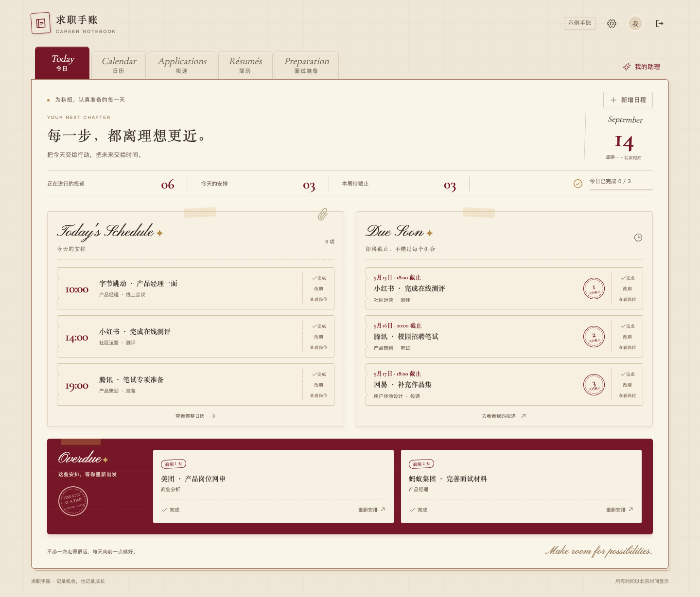

# 求职手账 · Career Notebook

把投递、面试、简历和准备资料放进一本可以持续使用的数字手账。

Career Notebook 是一个可自行部署的个人求职工作台。奶油色信纸、酒红色标签和手写标题组成界面；日程、岗位与资料相互关联，AI 助手负责整理信息，修改由你确认。适用于秋招、春招和日常求职，也可以完全不接 AI，作为手动管理工具使用。



> 截图使用演示数据。公开的是应用源码，不包含维护者的账号、简历、聊天记录、数据库或服务密钥。本项目面向个人自托管，不提供公共注册服务。

## 能做什么

| 模块 | 功能 |
| --- | --- |
| 今日与日历 | 今日安排、即将截止、逾期任务、完成状态与提醒 |
| 岗位投递 | 公司、城市、岗位、批次和阶段筛选；招聘截图、链接辅助录入；关联日程 |
| 简历管理 | 保存简历系列与版本，记录投递时使用的版本 |
| 面试准备 | 按岗位组织资料、导入 Word 文档、复用已有材料、润色与模拟问答 |
| 对话助理 | 持续聊天、历史恢复；查询现有记录，生成投递、日程和准备的关联操作草稿 |
| 联网搜索 | 可选 Tavily 搜索，显示来源链接与检索时间，并区分搜索摘要和网页全文 |
| 数据管理 | 按账号隔离数据；支持业务数据导出和带文件的 ZIP 导出 |

AI 生成的正式记录修改需要点击确认后执行。多项关联操作在同一事务中保存；记录已被其他设备修改时，会拒绝旧草稿覆盖。项目不会自动替你投递、发送招聘邮件或接受 Offer。

## 快速开始

准备 Node.js 22.12+（本项目在 Node.js 24 验证）、npm、Docker 和 Docker Compose。

```sh
git clone https://github.com/cnst27dsjv-cell/career-notebook.git
cd career-notebook
npm ci
cp .env.example .env
```

编辑 `.env`：

- 将 `DATABASE_URL` 中的 `CHANGE_ME` 改为 `career_local_only`，与默认 `compose.yml` 的本地数据库一致。这只是本机开发密码，不能用于公网部署。
- 将 `BETTER_AUTH_SECRET` 替换为随机长字符串，可用 `openssl rand -hex 32` 生成。
- 其余 AI 密钥可以先留空。

```sh
docker compose up -d
npx prisma generate
npx prisma migrate deploy
npm run db:seed
npm run dev
```

打开 [本地手账](http://127.0.0.1:3040)。种子脚本创建独立的示例账号，并把随机示例密码保存在本机 `.env` 中。你可以先浏览示例，再通过本地登录页的「创建我的空白手账」入口建立个人账号。

提醒功能需要另开一个终端：

```sh
npm run worker
```

默认邮件进入 [Mailpit](http://127.0.0.1:8026)，不会发送真实邮件。电脑或后台进程关闭后，本地提醒不会继续运行。

## 配置 AI 与搜索

密钥只配置在服务端环境中。修改本地 `.env` 后重启应用；线上部署需单独设置密钥。

| 配置 | 用途 |
| --- | --- |
| `TEXT_MODEL_BASE_URL` / `TEXT_MODEL_API_KEY` / `TEXT_MODEL_NAME` | 文本模型的 Chat Completions 接口，处理对话、提取与分类 |
| `TEXT_MODEL_POLISH_NAME` | 可选的润色模型；留空时使用通用文本模型 |
| `VISION_MODEL_BASE_URL` / `VISION_MODEL_API_KEY` / `VISION_MODEL_NAME` | 支持图片输入的模型，用于招聘截图识别 |
| `TAVILY_API_KEY` | 对话助手的联网搜索 |
| `SEARCH_MODEL_BASE_URL` / `SEARCH_MODEL_API_KEY` / `SEARCH_MODEL_NAME` | 面试调研等原有搜索入口，要求支持 Responses API 的 `web_search` 工具；不是 Tavily 配置 |

示例文件提供文本与视觉服务的配置形式，模型名称请按自己的服务账号填写。不同网关的接口支持可能不同；无密钥时仍可使用手动管理功能。

### 联网怎么使用

在助手中勾选「联网搜索」，输入完整的公开信息问题后发送。每条开启联网的消息执行一次 Tavily basic 搜索，最多返回 5 条摘要；回答下方保留来源和检索时间。搜索默认关闭，失败后手动重试可能再次消耗额度。

Tavily 仅收到当前问题，不接收历史聊天或工作台资料。文本模型会接收当前问题、有限的最近对话和与任务有关的工作台上下文；截图识别会把选中的图片发送给视觉服务。请根据所选服务的数据政策决定输入哪些内容。

## 部署到自己的服务器

提供两种路径：

- **Docker / 常驻服务器**：PostgreSQL、网页服务、独立提醒进程及文件存储。见[运行与部署说明](03_交付物/04_运行与部署说明.md)。
- **Cloudflare Workers**：vinext 构建，配合 Supabase PostgreSQL、私有 R2 文件桶和 Cron。见[Cloudflare 与 Supabase 部署说明](03_交付物/06_Cloudflare与Supabase部署.md)。

部署前修改 `wrangler.jsonc` 中的 Worker 名称、域名和 R2 桶，使用你自己的资源。示例中的域名不代表你有权向维护者的站点部署。先对目标数据库执行迁移，再发布匹配的代码。

生产环境关闭 `LOCAL_DEMO`，设置独立认证密钥和 HTTPS 地址，使用受控的账号创建脚本。真实邮件需要自行配置并验证发送服务：服务器路径使用 SMTP，Cloudflare 路径使用 Resend。数据与上传文件需自行备份。

**GitHub push 与线上部署是两个步骤。** 本仓库不默认替你建立自动发布流水线。

## 技术栈与目录

Next.js · React · TypeScript · PostgreSQL · Prisma · Better Auth · FullCalendar。Cloudflare 部署使用 vinext；本地邮件测试使用 Mailpit。

```text
app/          页面与服务端接口
components/   手账界面与交互
lib/          业务规则、模型调用、提醒与文件处理
prisma/       数据模型与版本化迁移
cloudflare/   云端数据库、文件、邮件适配
scripts/      初始化、运行与验收脚本
tests/        单元测试
deploy/       部署配置示例
docs/         设计记录与实现计划
```

## 开发与验证

```sh
npm run typecheck
npm test
npm run build          # Next.js 构建
npm run build:vinext   # Cloudflare 构建
```

集成检查应使用独立测试数据库，避免误操作个人数据：

- `scripts/integration-check.ts`：应用、文件、提醒和导出流程，需要本地服务与 worker。
- `scripts/assistant-check.ts`：对话草稿、账号隔离、并发确认与界面；加 `--model` 会调用真实模型。
- `scripts/assistant-search-check.ts`：真实搜索、来源保存和界面检查，会消耗 Tavily 与文本模型额度。
- `scripts/flows-check.ts`：首次开户流程，仅适用于没有个人账号的独立测试库。

TypeScript 脚本可通过 `npx tsx --env-file=.env scripts/脚本名.ts` 运行。浏览器验收脚本使用本机 Chrome。历史设计文档中的计划和待办不等于当前已实现功能，以源码和实际验证为准。

## 安全与隐私

不要提交 `.env`、`.dev.vars`、数据库备份、上传文件、真实简历或包含账号信息的截图。仓库已忽略本地配置、存储与临时目录，公开的 `.env.example` 只提供占位项。

提交 Issue 时请使用虚构数据复现，删除请求中的 Cookie、Authorization、邮箱、个人经历和密钥。发现泄露时先撤销或轮换凭据，再清理文件与历史；只删除当前文件不能消除历史中的内容。

欢迎提交不含个人数据的 Bug 报告和改进建议。涉及新功能时，请先说明使用场景和预期行为。
